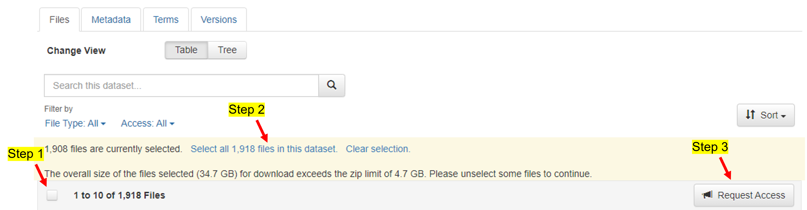

<h1 align="center"> 
AVCAffe: A Large Scale Audio-Visual Dataset of Cognitive Load and Affect for Remote Work
</h1>

<h3 align="center">
AAAI 2023
</h3>

<h3 align="center">
<a href="https://www.pritamsarkar.com">Pritam Sarkar</a>
&nbsp; <a href="">Aaron Posen</a>
&nbsp; <a href="">Ali Etemad</a>
</h3>

<h3 align="center"> 
<a href="https://doi.org/10.1609/aaai.v37i1.25078">[Paper]</a>   <!-- change with aaai link -->
<a href="./docs/assets/files/avcaffe_supp.pdf"> [Appendix]</a> 
<a href="https://arxiv.org/pdf/2205.06887.pdf"> [ArXiv]</a> 
<!-- <a href="https://github.com/pritamqu/AVCAffe"> [Code]</a>   -->
<a href="https://pritamqu.github.io/AVCAffe/"> [Website]</a>
</h3>


This is the official code repository of AVCAffe. Please check the project website: https://pritamqu.github.io/AVCAffe/ for additional details. Before you download and/or use the AVCAffe Dataset, please make sure you have read the Database License Agreement available here: [DLA](https://pritamsarkar.com/AVCAffe/LICENSE.html).

<!-- ### Items available -->
### Updates
- [x] Paper
- [x] Database license agreement
- [x] Instruction to download
- [x] Dataloader code
- [x] Database release
    - [x] Audio-visual recordings, ground truths, and additional meta data
    - [x] Face-crops (released on 20 July 2023, please see note below, if you already downloaded the old version.)


### Overview

AVCAffe is hosted in [borealisdata.ca](https://borealisdata.ca/) under [Queen's University Dataverse](https://borealisdata.ca/dataverse/queens). Please follow the instructions below to download the dataset.

The directory structure of the dataset is as follows. 

```    
    ├── ..                              # total size = 34.7 GB
    ├── ground_truths                   # size = 192 KB
    ├── info                            # size = 552 KB
    ├── videos                          
    |   │   ├── per_participant_per_task    # size = 13.9 GB; 950 files
    │   │   ├── aiim001
    │   │   ├── aiim002
    │   │   ├── ...
    │   │   ├── ...
    │   │   └── aiim108
    │   └── shorter_segments            # size = 20.3 GB; 58112 files
    │       ├── aiim001 
    │       ├── aiim002
    │       ├── ...
    │       ├── ...
    │       └── aiim108
    └── face_crops                       
        └── shorter_segments_face    # size = 41.7 GB
           ├── aiim001_task_1.zip
           ├── aiim001_task_2.zip
           ├── ...
           ├── ...
           └── aiim108_task_9.zip

```

- `ground_truths` contains the self-reported ground-truths for affect and cognitive load.
- `info` contains additional meta data, e.g., train-val split, pre-study responses, etc. Please find details below. 
- `videos/per_participant_per_task` contains full length videos of each participant per each task. Video length of 2.5-10 minutes, resolution of 640x360 pixel, format `.mp4`.  
- `videos/shorter_segments` contains segmented clips of the same videos in `per_participant_per_task`. Video length approximately 6 seconds, resized the shorter side at 256 pixel, format `.avi`. Note, the shorter clips are prepared for easy and efficient to use to train deep learning models. 
- `face_crops/shorter_segments_face` contains the face crops of the participants. To train the baseline models we use just the face-crops instead of the full frames, which works better (at-least for simple models).

### How to Request Access?


**Step 1:**
To access this dataset you must have an account in the Dataverse using an institutional email address. 
Please go to this link to create an account: https://borealisdata.ca/loginpage.xhtml. 

**Step 2:**
Once you have an account, and signed in on the same browser simply click on this link https://borealisdata.ca/dataverseuser.xhtml?selectTab=apiTokenTab, it will show the your `API Token`. Alternatively, you can click on the drop down list shown under your name (top right corner), and click `API Token`. Please note the `API Token` which will be required at future step.

**Step 3:** 
Once the account is created please go to this link https://borealisdata.ca/dataset.xhtml?persistentId=doi:10.5683/SP3/PSWY62. **Select all ~1,918~ 59960 files in this dataset** and **Request Access**. Please read the **Terms of Use** and **Terms of Access** and **Accecpt** to submit a request. Please see the screenshot below. This screenshot was taken before the face crops are uploaded. Now, the number of total files and size are changed.



**Step 4:**
Your request to access this dataset is successfully submitted. It may take 5-7 days to approve the request, if your access is not granted by that time, please write us an email at pritam.sarkar@queensu.ca and/or ali.etemad@queensu.ca. Once your request is approved please proceed to the next step.

### How to Download?

**Step 1:** 
We provide a script to download the dataset. Create a directory where you want to download the dataset and go to that directory. Please run the following commands from a terminal `mkdir avcaffe` and `cd avcaffe`.

**Step 2:**
Please run the following command to clone the github repository in your current location.
```
git clone https://github.com/pritamqu/AVCAffe.git
cd AVCAffe
```

**Step 3:** 
Please open the `codes/downloader/downloader.py` using a text editor. Please update the API_TOKEN variable with your `API Token` noted earlier.

**Step 4:** 
Next, please ensure you have the required packages installed or you can install them by running
```
pip install -r codes/downloader/requirements.txt
```

**Step 5:** 
You can download the entire dataset simply running the following command:
```
python codes/downloader/downloader.py
```

**Step 6:**
Congratualations! The dataset is downloaded.

**Updates on 20 July 2023**

We have now released the face crops. In case you have already downloaded this dataset before 20 July 2023, you may just download the face crops by following the given instruction [here](https://github.com/pritamqu/AVCAffe/issues/6#issuecomment-1652240043). If you encounter an error, please create an issue, I will look into it.

<!-- 
```
# TODO: update the downloader code to just download these files.
# TODO: test the downloader code for full download, and check the unzip path is not messed up.
``` -->

### Dataloader

We provide supporting codes for easy access of the dataset.  A dataloader written in PyTorch is available in `avcaffe/codes/dataloader/`. A minimum example usage is shown below and details usage is presented [here](./codes/dataloader/README.MD):

```
db = AVCAffe(ROOT,
             subset='train',
             return_video=True,
             video_clip_duration=2,
             video_fps=16.,
             return_audio=True,
             audio_clip_duration=2,
             audio_fps=16000,
             return_labels=True,
             class_name='mental_demand',
             mode='clip',
             clips_per_video=1,
             )

sample = db.__getitem__(1)

```

### Additional IMPORTANT Details

We list some of the additional details here:
- **the list of participants who agree to use their faces/images/videos for article or accopanied media contents, are available in `info/public_face_ids.txt`.**
- participants used for training and validation splits are mentioned in `info/train.txt` and `info/val.txt` respectively.
- the outcomes of prestudy questionnaire are available in `info/prestudy_response.csv`.
- some of the clips available in `shorter_segments` have no speech when the participant were listening to the other participant or thinking or trying to solve the tasks, the file ids of such clips are available in `info/no_audio_files.txt`.


### Citation
If you find this repository useful, please consider giving a star :star: and citation using the given BibTeX entry:
```
@misc{sarkar2022avcaffe,
title={AVCAffe: A Large Scale Audio-Visual Dataset of Cognitive Load and Affect for Remote Work},
author={Pritam Sarkar and Aaron Posen and Ali Etemad},
year={2022},
eprint={2205.06887},
archivePrefix={arXiv},
primaryClass={cs.HC}} 
```

### Question
You may directly contact me at <pritam.sarkar@queensu.ca> or connect with me on [LinkedIn](https://www.linkedin.com/in/sarkarpritam/).


